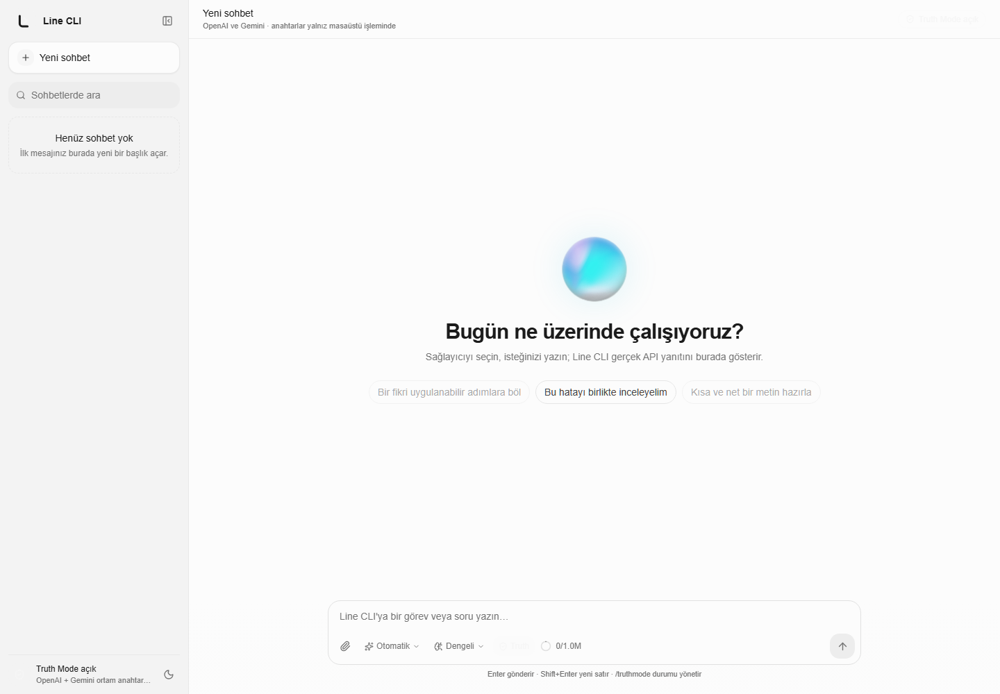
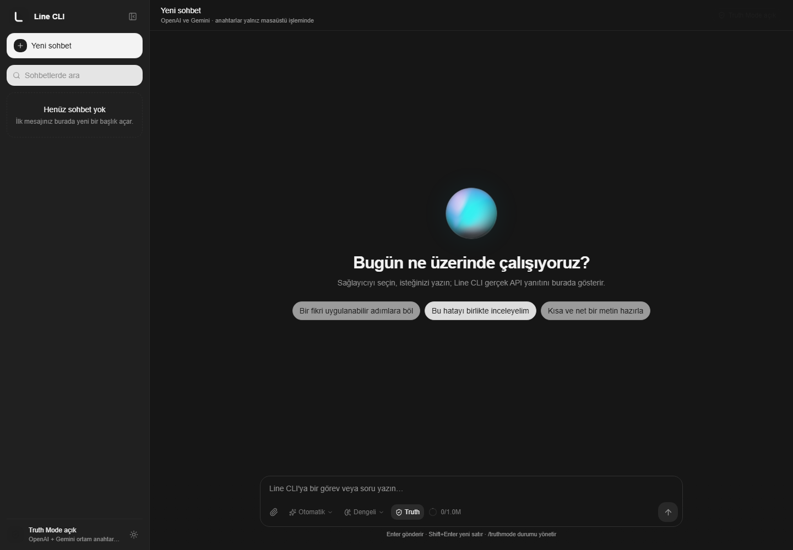

<p align="center">
  
</p>

<h1 align="center">Line CLI</h1>

<p align="center">
  <strong>Doğrudan OpenAI ve Gemini ile çalışan, yerel ve açık kaynak Windows yapay zekâ çalışma alanı.</strong>
</p>

<p align="center">
  
  
  
  
  
  
</p>

Line CLI, Windows üzerinde çalışan; OpenAI ve Gemini sağlayıcılarına doğrudan bağlanan, SmoothUI Chat Template temelli açık kaynak bir masaüstü yapay zekâ sohbet uygulamasıdır. Uygulamanın adı "CLI" olsa da dağıtılan ürün Tauri tabanlı grafik masaüstü uygulamasıdır.

## Uygulamadan görüntüler

Gerçek çalışan arayüzden, 1440 × 1000 çözünürlükte alınan ekran görüntüleri:

| ☀️ Açık tema | 🌙 Koyu tema |
| --- | --- |
|  |  |

## Öne çıkan özellikler

- 🎨 **SmoothUI arayüzü:** Açık/koyu tema, akıcı hareketler ve hareket azaltma tercihine saygı.
- 🔐 **Anahtar güvenliği:** OpenAI ve Gemini anahtarları yalnız Windows ortam değişkenlerinden native işlemde okunur.
- 🔀 **Sağlayıcı yönlendirme:** `Otomatik`, `OpenAI` ve `Gemini`; otomatik modda kontrollü OpenAI → Gemini geçişi.
- 🧠 **Akıl yürütme denetimi:** Hızlı, orta ve yüksek seviyeler sohbet kutusundan seçilir.
- 🛡️ **Truth Mode:** Varsayılan açık `/truthmode`, doğrulanmamış sonucu tamamlanmış gibi sunmayı önleyen sistem talimatı.
- 📎 **Güvenli dosya bağlamı:** Native sürükle-bırak, uzantı/boyut/adet sınırı ve UTF-8 metin okuma.
- 💬 **Yerel sohbet geçmişi:** Sohbetleri açma, yeniden adlandırma, arama ve silme.
- 🖱️ **Bağlam menüleri:** Sohbet ve mesajlarda fareyle sağ tık veya klavyeyle erişilebilir işlemler.
- 📐 **Responsive çalışma alanı:** Daraltılabilir kenar çubuğu ve küçük ekran uyarlaması.
- 🚫 **Temiz bağımlılık sınırı:** Line CLI başka bir yerel uygulamanın çalışma zamanına veya izinsiz üçüncü taraf sağlayıcı geçidine bağımlı değildir.

## Gereksinimler

- Windows 10 veya Windows 11
- Node.js 20 veya üstü
- pnpm 10
- Rust stable toolchain
- Tauri 2 için Windows WebView2 ve C++ derleme araçları
- En az bir sağlayıcı anahtarı

## Sağlayıcı yapılandırması

Anahtarları kaynak dosyasına veya `.env` dosyasına eklemeyin. Windows kullanıcı ortam değişkeni olarak tanımlayın ve ardından Line CLI'yi yeniden başlatın:

```powershell
[Environment]::SetEnvironmentVariable('OPENAI_API_KEY', 'ANAHTARINIZ', 'User')
[Environment]::SetEnvironmentVariable('GEMINI_API_KEY', 'ANAHTARINIZ', 'User')
```

İkinci Gemini anahtarı isteğe bağlıdır:

```powershell
[Environment]::SetEnvironmentVariable('GEMINI_API_KEY2', 'IKINCI_ANAHTARINIZ', 'User')
```

Varsayılan modeller isteğe bağlı olarak değiştirilebilir:

```powershell
[Environment]::SetEnvironmentVariable('LINE_CLI_OPENAI_MODEL', 'gpt-5.6-terra', 'User')
[Environment]::SetEnvironmentVariable('LINE_CLI_GEMINI_MODEL', 'gemini-3.7-flash', 'User')
```

Uygulama anahtar değerlerini arayüze döndürmez. Sağlayıcı hata metinleri cevaplanmadan önce anahtar değerlerinden arındırılır.

## Geliştirme

```powershell
pnpm install --frozen-lockfile
pnpm dev
```

Native geliştirme:

```powershell
pnpm tauri:dev
```

## Doğrulama ve derleme

Frontend statik kontrol, birim testleri ve production derlemesi:

```powershell
pnpm verify
```

Rust testleri:

```powershell
cargo test --manifest-path src-tauri/Cargo.toml
```

Portable Windows çalıştırılabilir dosyası:

```powershell
pnpm tauri:build
```

Çıktı `src-tauri/target/release/line-cli.exe` yolunda oluşur. Dağıtımdaki çalıştırılabilir dosya imzalanmamışsa Windows bunu bilinmeyen yayıncı olarak gösterebilir; yayın öncesinde güvenilir bir Authenticode sertifikasıyla imzalanması önerilir.

Doğrulama, Rust testleri, native derleme, masaüstü EXE kopyası ve temiz Git kaynak ZIP'i tek komutla üretilebilir:

```powershell
pnpm release:desktop
```

Komut masaüstünde yalnız `Line CLI.exe` ile `line-cli-src.zip` teslim dosyalarını günceller. Kaynak ZIP, Git'teki doğrulanmış `HEAD` içeriğinden üretildiği için `node_modules`, `target`, `.git`, ortam dosyaları ve yerel secret'ları içermez.

## Türkçe sürüm ve görsel güncelleme standardı

- Kullanıcıya görünen her değişiklik `CHANGELOG.md` içinde Türkçe kaydedilir.
- Arayüz değişikliklerinden sonra geliştirme sunucusu açıkken `pnpm docs:screenshots` çalıştırılır.
- Ekran görüntüleri sabit dosya adlarıyla yenilendiğinden README her zaman son açık/koyu arayüzü gösterir.
- Her yayın öncesinde `pnpm release:desktop` çalıştırılır ve GitHub sürümüne aynı doğrulanmış EXE ile kaynak ZIP yüklenir.
- CI; lint, TypeScript, React testleri, production build ve Rust testlerini Windows üzerinde yeniden çalıştırır.

Değişiklik geçmişi için [CHANGELOG.md](./CHANGELOG.md) dosyasına bakın.

## Dosya sürükle-bırak sınırları

- Tek işlemde en fazla 4 dosya.
- Dosya başına en fazla 1 MiB.
- Desteklenen uzantılar: `txt`, `md`, `json`, `csv`, `ts`, `tsx`, `js`, `jsx`, `py`, `rs`, `html`, `css`, `toml`, `yaml`, `yml`.
- Klasörler, çalıştırılabilir dosyalar ve desteklenmeyen ikili dosyalar reddedilir.
- Bırakılan dosya içeriği güvenilmeyen kullanıcı verisi kabul edilir; içindeki talimatlar sistem talimatı sayılmaz.

## Truth Mode

Truth Mode varsayılan olarak açıktır. Arayüzdeki kalkan düğmesiyle veya sohbet alanına aşağıdaki komutları yazarak değiştirilebilir:

```text
/truthmode
/truthmode aç
/truthmode kapat
```

Bu özellik model hatalarını tamamen ortadan kaldırma garantisi değildir. Model cevaplarını önemli kararlar öncesinde bağımsız olarak doğrulayın.

## Veri ve gizlilik

- Sohbet geçmişi cihazdaki WebView `localStorage` alanında tutulur.
- Mesaj gönderildiğinde seçili sağlayıcıya sohbet bağlamı ve eklenmiş dosya metni gönderilir.
- Telemetri veya ayrı bir Line CLI sunucusu bulunmaz.
- API kullanımı, kota ve ücretlendirme seçilen sağlayıcının hesabına aittir.

## Lisans ve atıf

Line CLI MIT lisansı altında yayımlanır. Arayüz, MIT lisanslı [SmoothUI Chat Template](https://smoothui.dev/docs/templates/chat) ve bileşenlerinden uyarlanmıştır. Ayrıntılar için `LICENSE` ve `THIRD_PARTY_NOTICES.md` dosyalarına bakın.
