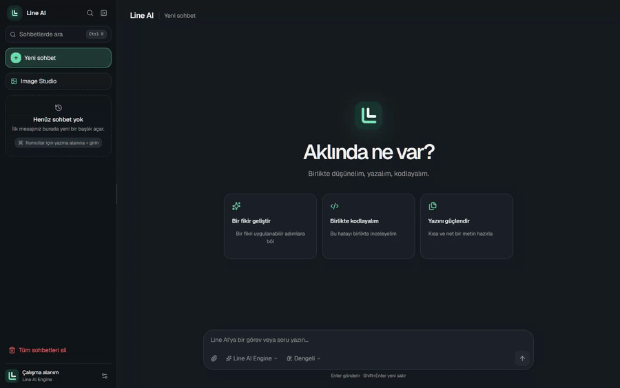
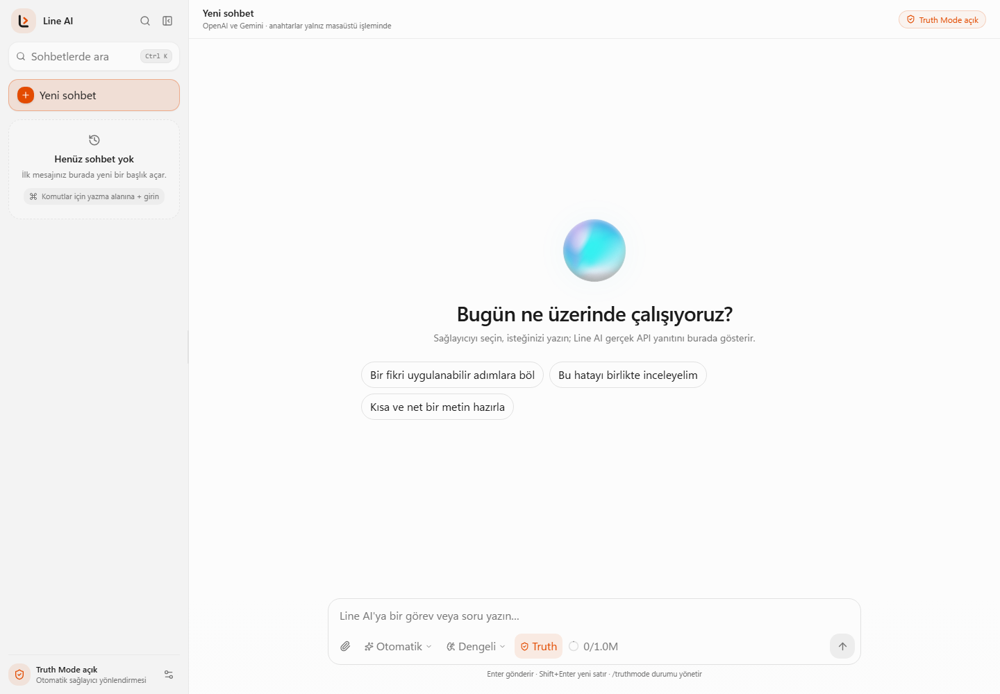
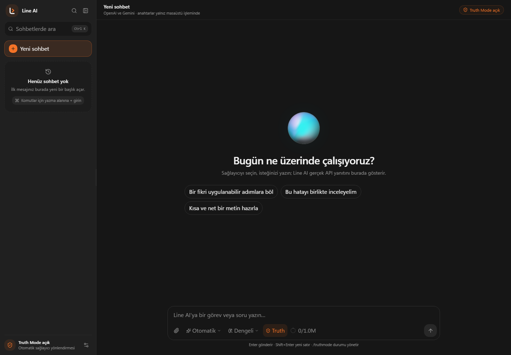

<p align="center">
  
</p>

<h1 align="center">Line AI</h1>

<p align="center">
  <strong>Fikrini, dosyalarını ve kodunu tek bir düzenli çalışma alanında buluşturan açık kaynak Windows yapay zekâ uygulaması.</strong>
</p>

<p align="center">
  
  
  
  
  
  
</p>

Line AI; OpenAI ve Gemini modellerini tek arayüzde kullandıran, sohbetleri cihazda düzenleyen ve dosya ya da klasör bağlamıyla çalışabilen bir Windows masaüstü uygulamasıdır. Gösterişli bir maket değil: sağlayıcı seçimi, akıl yürütme düzeyi, dosya okuma, hata durumu, geçmiş ve ayarlar gerçek uygulama akışlarına bağlıdır.

## Uygulamadan görüntüler



| ☀️ Açık tema | 🌙 Koyu tema |
| --- | --- |
|  |  |

## Öne çıkan özellikler

- 💬 **Düzenli sohbet çalışma alanı:** Sidebar'ın üstünde arama, yeni sohbet, zaman damgalı ve gruplandırılmış geçmiş, sabitleme, yeniden adlandırma, silme ve beş saniyelik geri alma.
- 🧭 **Gerçek Sidebar:** 240–400 piksel arasında sürüklenerek veya klavyeyle yeniden boyutlandırılan geniş görünüm; daraltılmış ikon şeridi ve mobil çekmece.
- 🔀 **Sağlayıcı yönlendirme:** `Otomatik`, `OpenAI` ve `Gemini`; otomatik modda kontrollü sağlayıcı geçişi.
- 🧠 **Akıl yürütme ve durum:** Hızlı, orta ve yüksek düzeyler; bekleme, düşünme, araç ve hata durumları sohbet içinde görünür.
- 🧩 **Yapılandırılmış yanıtlar:** Kod farkları, kaynak bağlantıları, görev adımları ve araç sonuçları uygun bileşenlerle gösterilir.
- ⚙️ **Ayrıntılı Ayarlar:** Genel, Yapay zekâ, Görünüm, Yerel veriler ve Hakkında bölümleri; değişiklikler gerçek tercih durumuna bağlıdır.
- 📎 **Dosya ve klasör bağlamı:** Windows sürükle-bırak, klasörleri güvenli biçimde dolaşma, tür/adet/boyut sınırı ve metin önizlemesi.
- ⌨️ **`+` komut paneli:** Görünür bir ek düğme olmadan sağlayıcı, akıl yürütme, Truth Mode ve ek dosya komutlarına hızlı erişim.
- 🔎 **Hızlı komut merkezi:** `Ctrl+K` ile sohbetleri, ayarları, sağlayıcıyı, akıl yürütmeyi ve temayı tek arama alanından yönetme.
- 🛡️ **Truth Mode:** Varsayılan açık doğruluk disiplini; doğrulanmamış sonucu tamamlanmış gibi göstermeyi engelleyen sistem talimatı.
- 🔐 **Anahtar güvenliği:** Sağlayıcı anahtarları yalnız native masaüstü sürecinde okunur; arayüze veya sohbet kaydına yazılmaz.
- 🌗 **Açık/koyu tema:** Sistem tercihini izleme, okunaklı tipografi ve hareket azaltma ayarına saygı.
- 📐 **Responsive yapı:** İçeriği ezmek yerine Sidebar ve panelleri ekran genişliğine uygun düzene dönüştürür.

## Gereksinimler

- Windows 10 veya Windows 11
- Node.js 20 veya üstü
- pnpm 10
- Rust stable toolchain
- Tauri 2 için Windows WebView2 ve C++ derleme araçları
- En az bir sağlayıcı anahtarı

## Sağlayıcı yapılandırması

Anahtarları kaynak dosyasına veya `.env` dosyasına eklemeyin. Windows kullanıcı ortam değişkeni olarak tanımlayın ve ardından Line AI'ı yeniden başlatın:

```powershell
[Environment]::SetEnvironmentVariable('OPENAI_API_KEY', 'ANAHTARINIZ', 'User')
[Environment]::SetEnvironmentVariable('GEMINI_API_KEY', 'ANAHTARINIZ', 'User')
```

İkinci Gemini anahtarı isteğe bağlıdır:

```powershell
[Environment]::SetEnvironmentVariable('GEMINI_API_KEY2', 'IKINCI_ANAHTARINIZ', 'User')
```

Varsayılan modeller isteğe bağlı olarak değiştirilebilir:

```powershell
[Environment]::SetEnvironmentVariable('LINE_AI_OPENAI_MODEL', 'gpt-5.6-terra', 'User')
[Environment]::SetEnvironmentVariable('LINE_AI_GEMINI_MODEL', 'gemini-3.7-flash', 'User')
```

Uygulama anahtar değerlerini arayüze döndürmez. Sağlayıcı hata metinleri kullanıcıya gösterilmeden önce anahtar değerlerinden arındırılır.

## Geliştirme

```powershell
pnpm install --frozen-lockfile
pnpm dev
```

Native geliştirme:

```powershell
pnpm tauri:dev
```

## Doğrulama ve derleme

Frontend statik kontrol, birim testleri ve production derlemesi:

```powershell
pnpm verify
```

Rust testleri:

```powershell
cargo test --manifest-path src-tauri/Cargo.toml
```

Portable Windows çalıştırılabilir dosyası:

```powershell
pnpm tauri:build
```

Çıktı `src-tauri/target/release/line-ai.exe` yolunda oluşur. Dağıtımdaki çalıştırılabilir dosya imzalanmamışsa Windows bunu bilinmeyen yayıncı olarak gösterebilir; yayın öncesinde güvenilir bir Authenticode sertifikasıyla imzalanması önerilir.

Doğrulama, Rust testleri, native derleme, masaüstü EXE kopyası ve temiz Git kaynak ZIP'i tek komutla üretilebilir:

```powershell
pnpm release:desktop
```

Komut masaüstünde `Line AI.exe` ile `line-ai-src.zip` teslim dosyalarını günceller. Kaynak ZIP, Git'teki doğrulanmış `HEAD` içeriğinden üretildiği için `node_modules`, `target`, `.git`, ortam dosyaları ve yerel secret'ları içermez.

## Dosya ve klasör sınırları

- Tek işlemde en fazla **30 dosya**.
- Dosya başına en fazla **512 MiB**.
- Model bağlamı için dosya başına en fazla 64 KiB, toplamda en fazla 2 MiB metin önizlemesi okunur; dosyanın kendisi değiştirilmez.
- Desteklenen uzantılar: `txt`, `md`, `json`, `csv`, `ts`, `tsx`, `js`, `jsx`, `py`, `rs`, `html`, `css`, `toml`, `yaml`, `yml`.
- Bırakılan klasörler alt klasörleriyle güvenli biçimde taranır; sembolik bağlantılar izlenmez, desteklenmeyen dosyalar atlanır.
- Doğrudan bırakılan desteklenmeyen veya ikili dosyalar açık hata mesajıyla reddedilir.
- Bırakılan içerik güvenilmeyen kullanıcı verisi kabul edilir; dosyadaki talimatlar sistem talimatı sayılmaz.

## `+` komut paneli

Sohbet alanı `+` ile başladığında komut paneli açılır. Kullanıcı buradan gerçek sağlayıcıyı ve akıl yürütme düzeyini değiştirebilir, Truth Mode'u açıp kapatabilir veya eklenmiş dosyaları temizleyebilir. `+` karakteri tek başına modele gönderilmez.

## Klavye kısayolları

- `Ctrl+K`: Sohbet ve gerçek uygulama komutlarını arayan komut merkezini açar.
- `Ctrl+N`: Yeni ve boş bir sohbet açar.
- `Ctrl+,`: Ayarlar panelini açar.
- `Enter`: Mesajı gönderir.
- `Shift+Enter`: Mesaj içinde yeni satır açar.

## Truth Mode

Truth Mode varsayılan olarak açıktır. Arayüzdeki kalkan düğmesiyle veya sohbet alanına aşağıdaki komutları yazarak değiştirilebilir:

```text
/truthmode
/truthmode aç
/truthmode kapat
```

Bu özellik model hatalarını tamamen ortadan kaldırma garantisi değildir. Önemli kararlar öncesinde model cevaplarını bağımsız olarak doğrulayın.

## Veri ve gizlilik

- Sohbet geçmişi cihazdaki WebView `localStorage` alanında tutulur.
- Mesaj gönderildiğinde seçili sağlayıcıya sohbet bağlamı ve eklenmiş dosya metni gönderilir.
- Telemetri veya ayrı bir Line AI sunucusu bulunmaz.
- API kullanımı, kota ve ücretlendirme seçilen sağlayıcının hesabına aittir.

## Türkçe sürüm ve görsel güncelleme standardı

- Kullanıcıya görünen her değişiklik [CHANGELOG.md](./CHANGELOG.md) içinde Türkçe kaydedilir.
- Arayüz değişikliklerinden sonra gerçek uygulamadan açık/koyu görüntüler ve tanıtım GIF'i yenilenir.
- Her yayın öncesinde doğrulama zinciri çalıştırılır; GitHub sürümüne aynı doğrulanmış EXE ve kaynak ZIP yüklenir.
- CI; lint, TypeScript, React testleri, production build ve Rust testlerini Windows üzerinde yeniden çalıştırır.

## Lisans ve atıf

Line AI MIT lisansı altında yayımlanır. Üçüncü taraf lisans ve telif bildirimleri [THIRD_PARTY_NOTICES.md](./THIRD_PARTY_NOTICES.md) içinde korunur.
