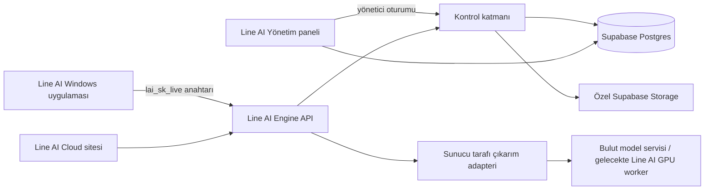

# Line AI Engine v0.6.0 — Sunucuda Çalışan API, Görsel Motoru ve Yönetim Alanı Tasarımı

## Durum ve amaç

Bu tasarım, 12 Eylül 2026 tarihinde kullanıcı tarafından onaylanan yönü tanımlar: Line AI, kullanıcının bilgisayarında Ollama veya başka bir yerel model çalıştırmayı gerektirmeyen, sunucuda çalışan kendi API katmanına sahip olacaktır. Masaüstü uygulaması yalnız güvenli bir Line AI anahtarıyla bu servise bağlanacak; model çalıştırma, kota, maliyet, görsel üretimi ve kalite politikası bulutta yürütülecektir.

Amaç, mevcut sohbet eşitleme API'sini gerçek bir ürün API'sine dönüştürmektir:

- Line AI'a ait proje, token, scope, kota ve denetim sistemi,
- metin ve görsel üretim için sunucu tarafı API,
- Windows uygulamasında güvenli Line AI sağlayıcısı ve modern üretim arayüzü,
- yalnız yöneticinin erişebildiği arka plan yönetim paneli,
- izinli geri bildirim, sürümlü davranış kuralları ve değerlendirme döngüsü,
- kamu sitesinde doğru, görsel açıdan güçlü ve abartısız ürün anlatımı.

## Açık gerçeklik sınırı

Line AI API'si, ürün katmanı olarak tamamen bize ait olacaktır: tokenlar, proje modeli, kota, politika, değerlendirme verisi, güvenlik, API sözleşmesi, yönetim paneli ve masaüstü deneyimi Line AI tarafından işletilir.

Bir temel modeli sıfırdan eğitmek, bu ürün sürümünün kapsamı değildir. Bunun için büyük ölçekli lisanslı veri, GPU kümesi, model güvenliği ve sürekli model operasyonu gerekir. İlk sürümde Line AI Engine, **sunucuda** yapılandırılan bir çıkarım sağlayıcısına veya gelecekteki Line AI GPU worker'ına bağlanır. Bu, kullanıcı bilgisayarında model çalıştırmaz. Sağlayıcı anahtarı programda ve tarayıcıda hiçbir zaman bulunmaz.

Barındırılan üretim için limitsiz bedava vaat kullanılmayacaktır. Metin ve görsel üretimi gerçek para ve kötüye kullanım riski taşır. Planlar açık kota/fair-use ile gösterilir; sınırsız olan yalnız fiziksel olarak maliyetsiz ürün yüzeyleri için söylenebilir. Kota ve maliyet görünür olduğunda kullanıcı ne aldığını bilir.

## Mevcut temel

v0.5.0'da `cloud/`, Vercel Functions ve Supabase ile kurulum kimliği, kurulum başına sohbet geçmişi ve sağlık kontrolü sağlar. `lai_live_…` kurulum sırrı Windows Credential Manager'da tutulur, Supabase'de yalnız özeti vardır. Bu kimlik yalnız sohbet eşitlemesi için kalacaktır; yeni ürün API anahtarı olarak yeniden kullanılmayacaktır.

Masaüstü uygulaması şu an OpenAI, Gemini ve isteğe bağlı loopback yerel sağlayıcılarını doğrudan çağırır. Line AI Engine yeni, açık seçilen bir sağlayıcı olacak; kullanıcı bilgisayarında model kurmasını veya çalıştırmasını istemeyecektir. Eski yerel sağlayıcı ileri seviye kullanıcı tercihi olarak korunabilir, fakat Line AI Cloud akışının parçası veya pazarlama vaadi olmaz.

## Sistem mimarisi

Kontrol katmanı Vercel ve Supabase üzerinde çalışır. GPU çıkarımı Vercel Function içinde çalıştırılmaz; Vercel yalnız yetkilendirme, yönlendirme, API ve panel katmanıdır. Çıkarım adapteri, ortam değişkeniyle belirtilen sunucu tarafı bir OpenAI uyumlu endpoint'e bağlanır. Bu endpoint ilk aşamada güvenilir bir bulut çıkarım hizmeti, ileride Line AI'ın kendi GPU worker'ı olabilir.

## Kimlik, proje ve anahtar modeli

### Ayrı kimlik türleri

| Tür | Biçim | Kullanım | Saklama |
| --- | --- | --- | --- |
| Kurulum sırrı | `lai_live_…` | Mevcut sohbet eşitlemesi | Windows Credential Manager ve hash |
| Proje API anahtarı | `lai_sk_live_…` | Line AI Engine metin/görsel çağrıları | Bir kez gösterim, sunucuda HMAC/SHA-256 özeti |
| Yönetici oturumu | HttpOnly oturum çerezi | Yönetim paneli | Tarayıcının JavaScript'i okuyamaz |

Yeni API anahtarı en az 256 bit rastgelelik içerir. Anahtar oluşturulunca yalnız bir kez tam değer olarak görüntülenir. Sonrasında panel sadece isim, güvenli prefix, scope, son dört karakter, oluşturulma zamanı, son kullanım ve durum gösterir. Anahtarın tam değeri log, telemetry, chat geçmişi, ekran görüntüsü veya audit kaydına yazılmaz.

### Proje anahtarları

Her anahtar bir projeye bağlıdır. Proje, takım/ürün adını, varsayılan planını, günlük ve aylık bütçesini, eşzamanlı iş sınırını ve aktif politika sürümünü taşır. İlk sürümde aşağıdaki kapsamlar bulunur:

- `chat:generate`
- `images:generate`
- `images:read`
- `assets:read`
- `feedback:write`

Anahtarın son kullanma tarihi, iptal durumu ve ayrı hız limiti vardır. İptal edilen veya süresi geçmiş anahtar hiçbir uç noktada başarılı görünmez. Anahtar rotasyonu yeni anahtar üretir; eski anahtar yönetici seçtiği anda iptal edilir veya kısa bir geçiş süresine alınır.

### Yönetici erişimi

Yönetim paneli mevcut kurulum sırrını kullanmaz. Supabase Auth ile kimlik doğrulanır; `line_ai_admin_users` tablosu kullanıcının aktif yönetici rolünü tutar. Başlangıç yöneticisi, yalnız bir kez kullanılabilen `LINE_AI_ADMIN_BOOTSTRAP_TOKEN` ile sunucu tarafında oluşturulur. Giriş akışı yalnız HTTPS üzerinden çalışır; oturum çerezi `HttpOnly`, `Secure`, `SameSite=Strict` olur. Yönetici endpoint'leri hem doğrulanmış kullanıcıyı hem aktif rolü her istekte denetler.

## API sözleşmesi

Tüm ürün API uç noktaları `/api/v1` altında sürümlüdür. Varsayılan olarak CORS kapalıdır; bir API anahtarının doğrudan tarayıcıya gömülmesi desteklenmez. İstemci tarafı kullanım için geliştiricinin kendi güvenli sunucusu veya Line AI masaüstü uygulaması kullanılır.

Her yazma isteği `Idempotency-Key` başlığı taşır. Sunucu her yanıta `x-lineai-request-id` ekler. Hata gövdeleri yapılandırılmıştır ve hiçbir zaman gizli değer, sağlayıcı gövdesi veya ham stack trace içermez.

### Yetenek ve kota

`GET /api/v1/capabilities`

Yetkili anahtarın kullanılabilir metin/görsel yeteneklerini, kalan görünür kotayı, etkin politika sürümünü ve servisin hazır olup olmadığını döndürür. Bu endpoint, masaüstü ayar ekranının sahte "hazır" durumu göstermesini engeller.

### Metin üretimi

`POST /api/v1/generate`

İstek; prompt, sınırlı konuşma bağlamı, yanıt stili, akıl yürütme tercihi ve istemci oturum kimliğini içerir. `Accept: text/event-stream` istenirse Line AI, `status`, `delta`, `completed` ve `error` olaylarını yayınlar. Akışsız kullanım aynı sonucu JSON döndüren açık bir modla alabilir.

İşlem sırası şöyledir:

1. Anahtarın hash'i, scope'u, proje durumu ve son kullanması denetlenir.
2. Postgres RPC, istek için kota/maliyet rezervasyonunu atomik biçimde oluşturur.
3. Aktif Line AI davranış politikası ve güvenli sistem talimatları eklenir.
4. Sunucu tarafı çıkarım adapteri isteği seçili modele iletir.
5. Gerçek kullanım ölçüsü varsa sağlayıcıdan, yoksa açıkça işaretlenmiş tahminden alınır.
6. Başarılı sonuç `succeeded`, başarısız/iptal olan işlem `reversed` usage kaydıyla kapanır.

Kullanıcı promptu ve yanıtı varsayılan olarak kullanım defterine yazılmaz. Audit kaydı yalnız operasyon, anahtar prefix'i, süre, durum, kullanım ve hata sınıfı tutar.

### Görsel üretimi

`POST /api/v1/images/generations`

İstek; prompt, stil şablonu, en-boy oranı, kalite ve isteğe bağlı varyasyon kaynağı içerir. v1'de istek, Vercel Function içinde arka planda bırakılmış sahte bir iş değildir: upstream tamamlanana kadar açık kalır, `image_job` kaydı gerçek durumu taşır ve tamamlanınca `201` döner. Timeout veya upstream hatası açık hata durumu verir ve kota rezervasyonu tersine çevrilir.

Görüntü verisi masaüstü ya da API istemcisine kalıcı base64 olarak taşınmaz. Sunucu, çıktıyı private Supabase Storage bucket'ına kaydeder ve bir `assetId` döndürür. `GET /api/v1/images/:jobId`, `GET /api/v1/assets/:assetId` ve `DELETE /api/v1/images/:jobId` yetki/scope kontrolüyle çalışır. Varlık indirme için kısa ömürlü imzalı URL veya yetkili indirme akışı kullanılır.

Vercel serverless sınırları yüzünden gerçek kuyruk v1'den sonra eklenir. Dayanıklı asenkron iş kuyruğu ve yeniden deneme, iş hacmi doğrulandıktan sonra ayrı worker ile gelir; `202 kabul edildi` sonucu ancak bu worker gerçekten devrede olduğunda kullanılır.

Görsel adapteri varsayılan olarak sunucu tarafı bir sağlayıcıya bağlanır. OpenAI Responses API'nin `image_generation` yeteneği resmi bir olası adapterdir; provider seçimi uygulama kodu yerine ortam yapılandırmasındadır. Sağlayıcı yapılandırılmamışsa görsel modu "hazır" diye görünmez, açıkça yapılandırma gerektiğini söyler.

## Veri modeli ve migration

Yeni, geri alınabilir Supabase migration'ı şu tabloları ekler. Mevcut sohbet tabloları ve kurulum kimlikleri değiştirilmez.

| Tablo | Amaç |
| --- | --- |
| `line_ai_admin_users` | Supabase Auth kullanıcısı, rol ve aktiflik |
| `line_ai_projects` | Ürün/proje, plan, bütçe ve aktif politika |
| `line_ai_api_keys` | Hash, prefix, scope, son kullanma, iptal ve son kullanım |
| `line_ai_entitlements` | Günlük/aylık kota, concurrency ve fair-use sınırları |
| `line_ai_usage_ledger` | `reserved`, `succeeded`, `reversed` maliyet/kullanım defteri |
| `line_ai_rate_limit_windows` | Anahtar ve zaman penceresi bazlı atomik hız limiti |
| `line_ai_idempotency_keys` | Tekrar gelen yazma isteğini güvenli biçimde sonuçlandırma |
| `line_ai_image_jobs` | Görsel üretim işi, durum, istek kimliği ve hata sınıfı |
| `line_ai_image_assets` | Private Storage yolu, boyut, mime ve sahip proje |
| `line_ai_policy_versions` | Sürümlü Line AI davranış/prompt kuralı |
| `line_ai_feedback` | Açık rızalı beğeni, etiket ve kısa not |
| `line_ai_evaluation_cases` | İnsan onaylı test girdisi ve rubrik |
| `line_ai_evaluation_runs` | Politika/model sürümüne karşı gerçek test sonucu |
| `line_ai_audit_log` | Yönetici eylemleri ve kırmızılaştırılmış operasyon kaydı |

RLS tüm bu tablolarda açık olur. `anon` ve `authenticated` doğrudan veri erişimi almaz; yalnız server-side servis rolü ve dar security-definer RPC fonksiyonları işlem yapar. Kota rezervasyonu, aynı anda iki isteğin kotayı aşmaması için transaction/row lock içinde yapılır; Vercel isolate belleğiyle sayaç tutulmaz.

Private `line-ai-assets` bucket'ı migration ile oluşturulur. Dosyalar proje ve job kimliği altında tutulur; public bucket, tahmin edilebilir public URL ve sınırsız kalıcılık kullanılmaz. Varsayılan saklama politikası 30 gündür; yönetici saklama süresini değiştirebilir ve kullanıcı/anahtar sahibi kendi varlığını silebilir.

## Line AI zekâ katmanı ve eğitim döngüsü

İlk sürümde "eğitim", model ağırlıklarını izinsiz veya otomatik değiştirmek anlamına gelmez. Line AI'a ait davranış katmanı şu bileşenlerden oluşur:

1. **Politika sürümleri:** Türkçe üslup, doğruluk, araç kullanımı, dosya davranışı ve marka sesi sürümlü olarak yönetilir.
2. **İzinli geri bildirim:** Kullanıcı yalnız kendi seçerse beğeni/beğenmeme, etiket ve kısa açıklama kalite havuzuna gider. Prompt/yanıt gövdeleri varsayılan olarak toplanmaz.
3. **Değerlendirme seti:** Yönetici onaylı örnek istekler ve rubrikler, yeni politika sürümünü yayına almadan önce ölçer.
4. **Kademeli yayın:** Bir politika sürümü önce test projesinde, sonra seçili projelerde, ardından genel kullanımda etkinleşir.
5. **İnsan onayı:** Fine-tuning, veri dışa aktarma veya yeni model sürümüne geçiş ancak açık yönetici kararıyla başlar.

Bu yapı, Line AI'ın davranışını kullanıcıya ait kontrol, kanıt ve geri bildirimle geliştirir. Tamamen Line AI tarafından işletilen ağırlıklar için gelecek fazda GPU altyapısı, lisanslı açık ağırlıklı model, güvenlik değerlendirmesi, veri saklama politikası ve model kartı gerekir.

## Masaüstü uygulaması

### Sağlayıcı ve anahtar saklama

Ayarlar → Yapay zekâ bölümüne **Line AI Engine** eklenir. Kullanıcı panelden oluşturduğu anahtarı bir kez girer. Tauri native katmanı bunu Windows Credential Manager'daki ayrı `Line AI Engine` kaydında saklar; React state, localStorage, sohbet geçmişi ve tanılama çıktılarına tam anahtar geçmez.

Sağlayıcı seçicide `Line AI Cloud` görünür. Seçildiğinde native Rust istemcisi doğrudan Line AI API'sine bağlanır; programda Ollama, Docker, Python veya GPU kurulumu gerekmez. Bağlantı durumu gerçek `capabilities` yanıtından gelir. Eksik anahtar, iptal edilmiş token veya kapalı görsel motor, kullanıcıya ayrı ve eyleme dönük durumla gösterilir.

### Metin ve görsel stüdyosu

Mesaj oluşturucuda erişilebilir bir **Metin / Görsel** kip seçicisi bulunur:

- Metin kipi mevcut sohbet akışını korur.
- Görsel kipi prompt, oran, kalite ve güvenli stil şablonları sunar: Ürün görseli, afiş, uygulama ekranı konsepti, illüstrasyon.
- Gerçek iş durumları: hazırlanıyor, sırada, üretiliyor, tamamlandı, başarısız, kota doldu.
- Tamamlanan asset kartında önizleme, indir, yeni varyasyon, sohbete ekle ve sil eylemleri yer alır.
- Sohbet geçmişine görsel dosyası değil `assetId`, güvenli başlık ve üretim metadatası yazılır.

Yeni uygulama görünümü, mevcut premium koyu/açık temayı Engine durumu, görsel varlık kartları, güvenli kota göstergesi, proje kimliği ve işlem kanıtlarıyla genişletir. Hareket azaltma, klavye odağı, dar pencere, hata, boş durum ve yüksek metin ölçeği korunur.

## Yönetim paneli

Yeni aynı-origin `/admin` yüzeyi, kamu landing sayfasından ayrı bir yönetim alanıdır. Giriş olmadan hiçbir veri veya metrik görünmez. Panelde şu bölümler bulunur:

1. **Genel bakış:** Canlı istek, hata oranı, metin/görsel kullanım, tahmini maliyet, aktif anahtar ve acil durdurma.
2. **Projeler ve anahtarlar:** Proje oluşturma, scope, kota, son kullanma, tek seferlik token gösterimi, iptal ve rotasyon.
3. **Kota ve kullanım defteri:** Günlük/aylık sınır, rezervasyon, başarı, geri alınan kullanım ve anahtar bazlı rapor.
4. **Görsel işleri:** Gerçek job durumu, hata sınıfı, private asset, silme ve saklama tarihi.
5. **Model ve politika:** Aktif adapter/model kimliği, politika sürümü, hazırlık/test/yayın durumu.
6. **Geri bildirim ve değerlendirme:** Açık rızalı kalite sinyalleri, test setleri, sürüm karşılaştırması.
7. **Denetim kaydı:** Yönetici eylemi, zaman, sonuç ve güvenli request kimliği.

Kritik eylemler (anahtar iptali, projeyi durdurma, politikayı yayınlama, asset silme) açık onay gerektirir. Panel hiçbir sağlayıcı gizli değerini görüntülemez veya tarayıcıya indirmez.

## Kamu sitesi ve ürün anlatımı

`https://lineaicloud.vercel.app/` yeni Engine bölümüyle güncellenir. Görsel tasarım premium temasını korur; ama ürün iddiaları doğrulanabilir kalır.

Site şunları anlatır:

- **Sunucuda çalışır:** Bilgisayara model kurma, GPU ayarlama veya anahtar dosyası koyma gerektirmez.
- **Tek ürün yüzeyi:** Metin, görsel, dosya bağlamı, güvenli proje tokenları ve kanıt tek çalışma alanında.
- **Kendine ait kontrol katmanı:** Token, kota, politika, sürüm ve kalite verisi Line AI'da yönetilir.
- **Şeffaf limitler:** Kullanım/kota açık görülür; hazır olmayan özellik hazırmış gibi pazarlanmaz.
- **Neden Line AI:** Codex, Gemini veya Claude birer güçlü model/yardımcı olabilir. Line AI "onlardan daha iyi model" iddiası yapmaz; kendi API'si, masaüstü çalışma alanı, proje bazlı kontrol, görsel üretim, kanıt ve yönetim alanını tek ürün olarak sunar.

Site görsel şölene CSS/SVG hareketleri, gerçek uygulama kayıtları, aktif Engine kartları, ürün içi görsel örnekleri ve etkileşimli API akışı ekler. Üretilmiş örnek görsel varsa kaynağı doğru etiketlenir; stok/fake ekran görüntüsü "gerçek uygulama" diye sunulmaz.

## Ortam yapılandırması

Gizli değerler yalnız Vercel/Supabase güvenli ortamında tanımlanır. Kaynakta, masaüstü ayarlarında veya kamu sitesinde değer bulunmaz.

| Ortam değişkeni | Amaç |
| --- | --- |
| `SUPABASE_URL`, `SUPABASE_SECRET_KEY`, `SUPABASE_ANON_KEY` | Server-side veritabanı ve Supabase Auth erişimi |
| `LINE_AI_IP_PEPPER` | IP/user-agent ve anahtar hash işlemleri |
| `LINE_AI_KEY_PEPPER` | API anahtarı HMAC/hash işlemi |
| `LINE_AI_ADMIN_BOOTSTRAP_TOKEN` | İlk yönetici oluşturma için tek kullanımlık gizli değer |
| `LINE_AI_ENGINE_ENABLED` | Güvenli rollout/geri alma bayrağı |
| `LINE_AI_ENGINE_UPSTREAM_PROVIDER`, `LINE_AI_ENGINE_UPSTREAM_URL` | Sunucu tarafı metin çıkarım adapteri ve endpoint'i |
| `LINE_AI_ENGINE_UPSTREAM_KEY` | Sunucu tarafı metin çıkarım anahtarı |
| `LINE_AI_ENGINE_MODEL` | Aktif metin model kimliği |
| `LINE_AI_IMAGE_PROVIDER` | Etkin görsel adapteri |
| `LINE_AI_IMAGE_MODEL` | Aktif görsel model kimliği |

Bu değerlerden biri eksikse ilgili özellik kapalı ve açık bir yapılandırma durumu gösterir. Uygulama hiçbir zaman uydurma yanıt/görsel üretmez veya başka sağlayıcıya sessizce düşmez.

## Güvenlik, veri ve operasyon ilkeleri

- Prompt, ek, token, cookie ve upstream yanıtındaki sır benzeri alanlar log/audit/telemetry öncesinde redakte edilir.
- İstemciye server-side model anahtarı, Supabase service-role anahtarı veya yönetici rol bilgisi verilmez.
- İstek ve asset erişiminde proje sahipliği her katmanda denetlenir.
- Prompt veya görsel isteği daha yüksek yetki, terminal komutu, URL talimatı veya admin eylemi doğurmaz.
- Sağlayıcı hatası; upstream detayını saklayan, anlaşılır ve retryability bilgisi olan bir Line AI hatasına dönüştürülür.
- Timeout, idempotency, iptal ve kota geri alma davranışı sözleşme testleriyle doğrulanır.
- Metrikler prompt gövdesi olmadan request id, durum, süre, model/politika sürümü ve kullanım ölçüsü taşır.
- Production geçişi `LINE_AI_ENGINE_ENABLED` ile geri alınabilir. Migration eklemelidir; mevcut sohbet verisini silmez veya dönüştürmez.

## Uygulama fazları

1. **Kontrol çekirdeği:** Migration, admin bootstrap/login, proje/anahtar/entitlement/usage RPC'leri, audit ve API sözleşmesi.
2. **Metin motoru:** `capabilities` ve `generate`, server-side adapter, native Credential Manager entegrasyonu, Line AI sağlayıcı seçimi.
3. **Görsel motor:** Private bucket, sync job modeli, asset uçları, masaüstü Metin/Görsel kipi ve gerçek asset kartları.
4. **Öğrenme döngüsü:** Politika sürümleri, izinli feedback, değerlendirme seti, kademeli yayın paneli.
5. **Ürün yüzeyleri:** Yönetim paneli, kamu sitesi API/Engine anlatımı, gerçek ekran/video güncellemesi, masaüstü premium arayüzü.

Her faz kendi testleri, hata durumları ve görünür yapılandırma durumu olmadan bir sonraki faza geçmez.

## Kabul ölçütleri

- Yönetici bir proje yaratabilir, scope/kota tanımlayabilir, anahtarı yalnız bir kez görebilir, anahtarı iptal edip kullanımını inceleyebilir.
- Token doğrulaması, scope, son kullanma, rate limit ve atomik kota rezervasyonu test edilir.
- Masaüstü uygulaması Line AI Engine anahtarını Credential Manager'da saklar ve yalnız açık kullanıcı seçimiyle sunucu API'sini çağırır.
- Sunucu yapılandırılmamışsa metin/görsel UI'si dürüst hatayı gösterir; sahte yanıt veya gizli fallback yapmaz.
- Görsel üretimi yapılandırıldığında gerçek job, private asset, preview, indirme ve silme akışı çalışır.
- Yönetim paneli erişimi doğrulanmamış kullanıcıya kapalıdır; servis anahtarı tarayıcıda görülmez.
- Kamu sitesi limitsiz bedava bulut veya model üstünlüğü gibi doğrulanamayan iddialar kullanmaz.
- Bir üretim sürümü; API sözleşme testleri, migration doğrulaması, desktop/native testleri, erişilebilirlik, canlı smoke ve gerçek configured-provider e2e kanıtı olmadan tamamlandı diye raporlanmaz.

## Karar kayıtları

- **Kabul edildi:** Sunucu tarafı Line AI Engine; kullanıcı bilgisayarında model çalıştırma zorunluluğu yok.
- **Kabul edildi:** Kurulum sırrı ile API anahtarı ayrılacak.
- **Kabul edildi:** Token, kota, maliyet ve panel gerçek veriye dayanacak.
- **Kabul edildi:** Görsel üretimi private asset ve gerçek job durumu üzerinden çalışacak.
- **Kabul edildi:** Eğitimi temsil eden mekanizma izinli geri bildirim, politika sürümü ve eval döngüsüdür; otomatik fine-tuning değildir.
- **Reddedildi:** Limitsiz bedava hosted model/görsel üretimi veya hazır olmayan özelliği pazarlama iddiası olarak gösterme.
